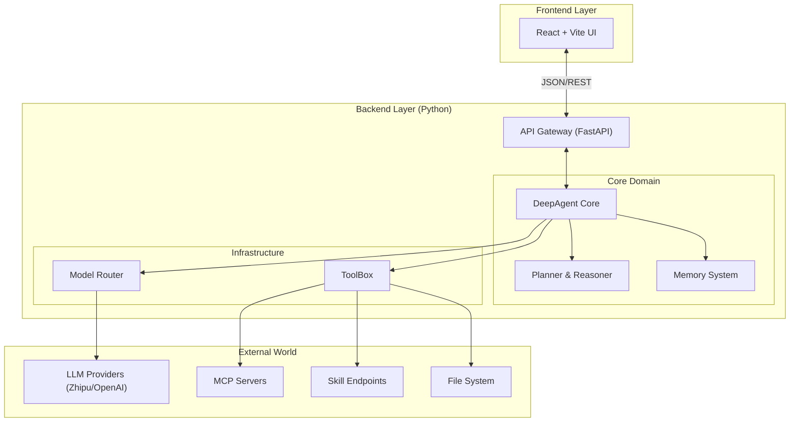
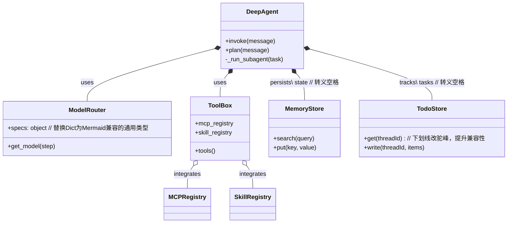
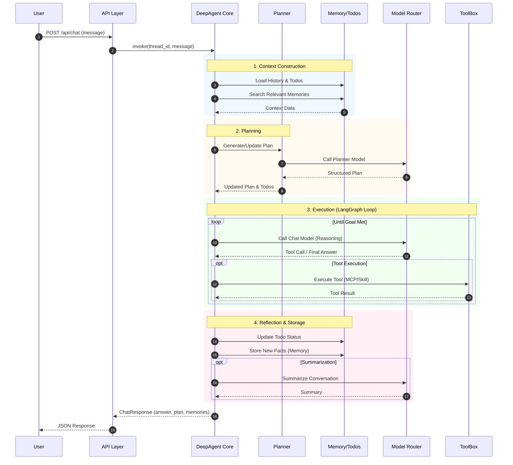

# DeepAgent Architecture

This document provides a comprehensive overview of the DeepAgent system architecture, designed for modularity, scalability, and robust agentic workflows.

## 1. High-Level Architecture

DeepAgent follows a layered architecture pattern, strictly separating API concerns from core business logic and external integrations.

## 2. Core Module Design

The `core` module is the heart of the application, enforcing the Single Responsibility Principle (SRP).

### Directory Structure
- `deepagent.core.agent`: Main orchestration logic and state management.
- `deepagent.core.memory`: Long-term persistent memory and vector search.
- `deepagent.core.models`: LLM adapter layer and routing logic.
- `deepagent.core.todos`: Task tracking and persistence.
- `deepagent.core.toolbox`: Tool registration, MCP client integration, and subagent delegation.

### Class Relationship Diagram

## 3. Data Flow & Execution Pipeline

When a user sends a message, DeepAgent executes a structured cognitive cycle:

1.  **Context Construction**:
    *   Retrieves recent conversation history.
    *   Searches long-term memory for relevant facts.
    *   Loads current Todo list state.
2.  **Planning (Reasoning)**:
    *   Uses the `planner` model to analyze the request.
    *   Generates or updates the `Plan` and `TodoItems`.
3.  **Execution**:
    *   The LangGraph-based engine executes tools defined in the plan.
    *   Supports recursive sub-agent spawning for complex sub-tasks.
4.  **Reflection & Storage**:
    *   Summarizes the interaction if the conversation turn limit is reached.
    *   Stores new facts into `MemoryStore`.
    *   Updates `TodoStore` with task completion status.
5.  **Response**:
    *   Returns the final answer along with the updated plan, todos, and relevant memories to the client.

## 4. Key Technical Decisions

*   **LangGraph Foundation**: Uses LangGraph for stateful, cyclic agent workflows, allowing for retries, human-in-the-loop (future), and complex branching.
*   **Model Agnostic**: The `ModelRouter` decouples the system from specific providers. Configuration allows swapping models (e.g., Zhipu vs OpenAI) for different pipeline steps (Chat vs Plan vs Summary) without code changes.
*   **Protocol Oriented**: First-class support for the Model Context Protocol (MCP), enabling standard integration with external tools and data sources.
*   **Recursive Agents**: The architecture supports "fractal" scaling, where an agent can spawn a child agent (with its own isolated context and tools) to solve a sub-problem, returning only the final result to the parent.
